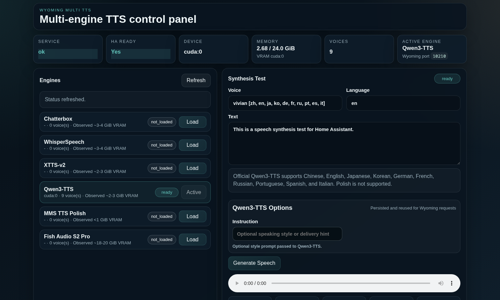

# wyoming-multi-tts for Home Assistant

Multi-engine TTS server for Home Assistant using Wyoming Protocol. It exposes one Wyoming endpoint on port `10210` and a web control panel on port `8280` for loading, switching, and testing engines.



## Included Engines

- `Chatterbox`
- `WhisperSpeech`
- `XTTS-v2`
- `Qwen3-TTS`
- `MMS TTS Polish`
- `Fish Audio S2 Pro`

## Requirements

- Linux host with Docker and Docker Compose
- NVIDIA GPU recommended
- CPU-only mode also works as a fallback, but it is much slower
- NVIDIA Container Toolkit
- CUDA 12.6 compatible NVIDIA driver on the host
- Hugging Face token
- External Docker network, by default `bridge-network`

## Quick Start

1. Create `.env`:

```bash
cp .env.example .env
```

2. Edit `.env`:

```env
HF_TOKEN=your_huggingface_token
DOCKER_NETWORK=bridge-network
```

3. Create the Docker network once:

```bash
docker network create bridge-network
```

4. Build and start:

```bash
docker compose up -d --build
```

5. Open:

- Web UI: `http://YOUR_HOST:8280`
- Wyoming: `tcp://YOUR_HOST:10210`

## Using It

1. Open the web UI
2. Click `Load` on the engine you want to use
3. Wait for `ready`
4. Optionally test synthesis in the UI
5. In Home Assistant, add the Wyoming integration and point it to port `10210`

Only one engine stays loaded at a time. When you switch engines, the previous one is unloaded to save VRAM. The last loaded engine is persisted and auto-loaded again after restart.

## OpenAI-Compatible TTS Endpoint

The HTTP server also exposes an OpenAI-style speech endpoint on port `8280`:

- `POST /v1/audio/speech`

Example:

```bash
curl -X POST http://YOUR_HOST:8280/v1/audio/speech \
  -H "Content-Type: application/json" \
  -d '{
    "model": "gpt-4o-mini-tts",
    "input": "This is a speech synthesis test.",
    "voice": "default",
    "response_format": "wav"
  }' \
  --output speech.wav
```

Current behavior:

- The endpoint uses the currently active engine from the control panel / Wyoming manager.
- Supported `response_format` values are `wav` and `pcm`.
- `model` is currently accepted for client compatibility but ignored by the server.
- `speed` is currently accepted for client compatibility but ignored by the server.

## Persistent Data

The compose file stores runtime data in:

- `./data/hf-cache`
- `./data/state`
- `./data/speakers`

## Useful Commands

Rebuild:

```bash
docker compose up -d --build
```

Run tests:

```bash
./.venv/bin/pytest -q
```

Compile check:

```bash
python3 -m compileall app tests
```

Optional: prebuild a local `flash-attn` wheel for `Qwen3-TTS`:

```bash
./scripts/build_flash_attn_wheel.sh
```

## License

This repository's code is released under the MIT license. See [LICENSE](./LICENSE).

Models and third-party runtimes keep their own licenses:

- `Qwen/Qwen3-TTS-12Hz-0.6B-CustomVoice`: Apache-2.0  
  https://huggingface.co/Qwen/Qwen3-TTS-12Hz-0.6B-CustomVoice
- `ResembleAI/chatterbox`: MIT  
  https://huggingface.co/ResembleAI/chatterbox
- `facebook/mms-tts-pol`: CC-BY-NC-4.0  
  https://huggingface.co/facebook/mms-tts-pol
- `coqui/XTTS-v2`: Coqui Public Model License  
  https://huggingface.co/coqui/XTTS-v2
- `WhisperSpeech`: MIT  
  https://github.com/WhisperSpeech/WhisperSpeech
- `fishaudio/s2-pro`: Fish Audio Research License, commercial use requires a separate license from Fish Audio  
  https://huggingface.co/fishaudio/s2-pro

Commercial use depends on which engine and model weights you enable. In particular, `facebook/mms-tts-pol` is non-commercial under CC-BY-NC-4.0, and `fishaudio/s2-pro` requires a separate commercial license from Fish Audio.
